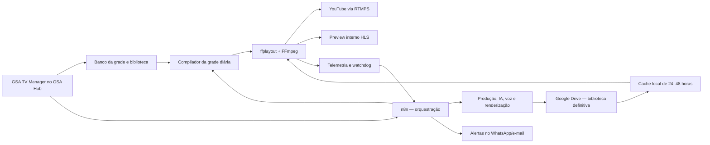

# Plano diretor — GSA TV 24 horas

> **DOCUMENTO HIST?RICO / SUPERADO.** Google Drive/rclone n?o fazem parte da arquitetura operacional atual. A VPS ? o armazenamento definitivo. Consulte `docs/arquitetura-atual-gsa-tv.md` e `infrastructure/gsa-tv/README.md`.

**Data do diagnóstico:** 17/08/2026  
**Objetivo:** operar uma programação GSA TV 24/7 no YouTube, integrada ao GSA Hub, com o n8n orquestrando ingestão, produção, grade, alertas e contingência.

> Decisão aprovada: a implantação seguirá com ffplayout + FFmpeg. O roteiro executivo completo está em [Plano de implementação — GSA TV 24/7](./plano-implementacao-gsa-tv.md).

> Armazenamento aprovado: o Google Drive será a biblioteca definitiva de todos os vídeos, masters, versões de transmissão, vinhetas, comerciais, previews, miniaturas e documentos. A VPS manterá somente cache operacional de 24–48 horas e contingência.

## 1. Decisão técnica principal

O nome correto do software discutido é **CasparCG**.

A VPS Oracle atual foi inspecionada e possui:

- Oracle Linux Server 9.8;
- arquitetura ARM64 (`aarch64`), 4 vCPUs Neoverse-N1;
- 22 GiB de RAM e 5 GiB de swap;
- disco raiz de 183 GiB, com aproximadamente 157 GiB livres;
- Docker e Docker Compose;
- n8n 2.33.5, PostgreSQL, Redis e outros serviços do GSA Hub em execução;
- nenhuma GPU dedicada e nenhum FFmpeg/CasparCG instalado.

O CasparCG exige GPU compatível com OpenGL 4.5, recomenda GPU Nvidia e declara Intel/AMD como processadores testados. A instalação oficial para Linux recomenda Ubuntu 24.04. A VPS atual é ARM64, Oracle Linux e não possui a GPU exigida.

### Caminho recomendado para o MVP

Usar na VPS atual:

- **ffplayout + FFmpeg** como motor de playout headless;
- **n8n** como orquestrador, nunca como player de tempo real;
- **GSA TV Manager** dentro do painel administrativo do GSA Hub;
- **Supabase/PostgreSQL** para programas, grade, direitos e auditoria;
- **Google Drive** como biblioteca definitiva e arquivo central;
- cache local na VPS apenas para o conteúdo que entrará no ar nas próximas 24–48 horas;
- saída RTMPS direta para o YouTube.

Esse desenho é compatível com operação sem interface gráfica e sem GPU. A versão exata do ffplayout deverá ser fixada e validada em um teste de 72 horas antes da produção.

### Caminho alternativo se o CasparCG for obrigatório

Manter o GSA Hub, n8n, banco e biblioteca na VPS atual e contratar/provisionar um segundo nó:

- x86_64;
- Ubuntu 24.04 ou Windows;
- GPU com OpenGL 4.5;
- CasparCG Server;
- comunicação privada com a VPS de controle.

Nesse cenário, a VPS atual continua sendo o cérebro da operação e o segundo servidor vira somente a ilha de exibição.

## 2. Arquitetura-alvo

### Regra estrutural

O motor de playout deve continuar transmitindo mesmo que o GSA Hub, o n8n ou uma API de IA fique temporariamente indisponível. A grade já compilada, o cache local e um vídeo de contingência garantem essa independência.

## 3. Formato técnico inicial da transmissão

### MVP recomendado

- resolução: 1280×720;
- 30 fps progressivo;
- vídeo H.264;
- bitrate CBR de 4 Mbps;
- keyframe a cada 2 segundos;
- áudio AAC estéreo, 48 kHz, 128 kbps;
- aspecto 16:9;
- saída RTMPS;
- masters e projetos gráficos produzidos em 1080p para preservar qualidade futura.

O YouTube recomenda 4 Mbps para H.264 em 720p30 e 10 Mbps para 1080p30. Em operação contínua, 720p30 consumirá aproximadamente 1,34 TB de saída por mês e cerca de 44,6 GB para cada 24 horas de mídia única. Em 1080p30, seriam aproximadamente 3,28 TB por mês e 109 GB por dia. Por isso, o disco da VPS deve funcionar como cache, não como arquivo definitivo.

Depois do teste de carga, a transmissão poderá evoluir para 1080p30. A subida só deve ocorrer se CPU, estabilidade e rede mantiverem folga durante 72 horas.

## 4. Módulo GSA TV Manager dentro do GSA Hub

### Telas do painel

1. **Central ao vivo**
   - status da transmissão;
   - programa atual e próximo;
   - preview interno;
   - tempo restante;
   - saúde do YouTube, CPU, memória, disco e fila;
   - comandos autorizados: próximo conteúdo, inserir contingência e encerrar com segurança.

2. **Grade semanal**
   - calendário de domingo a domingo;
   - arrastar e soltar programas e intervalos;
   - recorrência semanal;
   - validação de buracos, conflitos, duração e direitos;
   - publicação com histórico de versões e aprovação.

3. **Programas e quadros**
   - catálogo totalmente configurável, sem nomes fixados no código;
   - nomes como GSA Notícias, GSA Tech, GSA Empresas, GSA Educação, GSA Saúde e GSA Kids são apenas exemplos provisórios para orientar o desenho do sistema;
   - vinheta, identidade, duração, classificação, responsáveis e regras de repetição.

4. **Biblioteca de mídia**
   - upload e importação;
   - metadados técnicos e editoriais;
   - duração, resolução, áudio, checksum e miniatura;
   - status: recebido, validando, aprovado, bloqueado, agendado ou expirado;
   - versões normalizadas para transmissão.

5. **Direitos e conformidade**
   - titular, origem, licença, prova documental, território e validade;
   - indicação de conteúdo próprio, domínio público, licenciado ou gerado com IA;
   - bloqueio automático de item sem licença aprovada ou expirada.

6. **Comerciais GSA**
   - campanhas, peças, vigência, prioridade e frequência;
   - regras para evitar repetição excessiva;
   - relatório do que efetivamente foi ao ar.

7. **Automações**
   - fluxos n8n, última execução, falhas, reprocessamento e custos de API;
   - aprovação humana para conteúdo jornalístico antes da publicação.

8. **Ocorrências e auditoria**
   - quedas, mídia ausente, silêncio, erro de licença, atraso de grade e reinício;
   - registro de quem aprovou, alterou ou colocou cada conteúdo no ar.

## 5. Modelo de dados inicial

Criar entidades separadas para:

- `tv_channels` — canal e parâmetros de transmissão;
- `tv_programs` — programas, quadros e identidade;
- `tv_assets` — mídia e metadados editoriais;
- `tv_asset_renditions` — versões técnicas normalizadas;
- `tv_rights` — licenças e evidências;
- `tv_schedule_days` — versões publicadas da grade diária;
- `tv_schedule_items` — conteúdos, horários, duração e prioridade;
- `tv_commercial_campaigns` — campanhas e regras de inserção;
- `tv_playout_runs` — cada execução do canal;
- `tv_playout_events` — início, fim, falha, salto e contingência;
- `tv_automation_jobs` — trabalhos do n8n e renderizações;
- `tv_incidents` — ocorrências, impacto e resolução.

As políticas de acesso devem separar administrador, programador, editor, revisor jurídico/editorial e operador de plantão.

## 6. Automações n8n

### Fluxo 1 — entrada e validação de mídia

1. Receber arquivo ou URL autorizada.
2. Gerar checksum e consultar metadados com FFprobe.
3. Validar codec, resolução, duração, trilha de áudio e licença.
4. Normalizar/transcodificar para o padrão da emissora.
5. Criar miniatura e preview.
6. Salvar no Google Drive, registrar o ID imutável do arquivo e seus metadados no banco.
7. Enviar para aprovação humana.

### Fluxo 2 — produção de conteúdo próprio

1. Disparar pelo calendário editorial.
2. Consultar somente fontes autorizadas/licenciadas.
3. Gerar pauta e rascunho do roteiro.
4. Exigir revisão editorial, especialmente para notícias, saúde, finanças e temas sensíveis.
5. Gerar voz masculina ou feminina definida para o programa.
6. Montar imagens, manchetes, GC, vinheta, trilha e créditos.
7. Renderizar, validar e enviar para aprovação.
8. Publicar na biblioteca apenas após aprovação.

### Fluxo 3 — compilação da grade

1. Executar diariamente e sempre que uma grade aprovada mudar.
2. Resolver recorrências, comerciais, reprises e fillers.
3. Verificar duração total, direitos e disponibilidade física dos arquivos.
4. Baixar do Google Drive para o cache local o conteúdo das próximas 24–48 horas.
5. Gerar a playlist diária do motor de playout.
6. Manter a última playlist válida caso a nova falhe.

### Fluxo 4 — monitoramento e contingência

1. Receber heartbeat do motor a cada minuto.
2. Verificar processo, saída RTMPS, conteúdo atual, próximo item, disco e atraso.
3. Reiniciar o componente com falha quando a ação for segura.
4. Se um arquivo faltar, inserir filler ou institucional de contingência.
5. Se a transmissão cair, tentar reconectar e alertar o operador.
6. Registrar o incidente e enviar resumo pelo canal definido.

### Fluxo 5 — direitos autorais

1. Revalidar diariamente licenças próximas do vencimento.
2. Retirar automaticamente da grade qualquer item vencido ou sem prova.
3. Avisar os responsáveis com antecedência.
4. Manter relatório de origem e autorização de tudo que foi ao ar.

## 7. Referência ilustrativa de programação

> A programação ainda será criada. Os nomes, horários, durações e formatos abaixo são somente exemplos de como o sistema poderá organizar uma grade semanal. Nenhum deles está aprovado ou deve ser fixado na implementação.

### Segunda a sexta

| Faixa | Conteúdo-base |
|---|---|
| 00h–06h | reprises, documentários e institucional |
| 06h–08h | GSA Bom Dia / notícias e serviços |
| 08h–10h | GSA Kids com conteúdo devidamente licenciado |
| 10h–12h | GSA Educação e GSA Saúde |
| 12h–13h | GSA Notícias |
| 13h–14h | GSA Hub, oportunidades e comerciais |
| 14h–16h | documentários |
| 16h–18h | GSA Tech e GSA Empresas |
| 18h–19h | atualização GSA Notícias |
| 19h–22h | entrevistas, especiais e programas próprios |
| 22h–00h | documentário, cultura ou retrospectiva |

### Fim de semana

- sábado: turismo, cultura, música licenciada, esporte, agro e especiais;
- domingo: Kids, natureza, história, documentários, retrospectiva semanal e especial noturno.

Essa grade serve somente como demonstração funcional. A grade oficial será criada posteriormente e deverá definir nomes, durações exatas, intervalos, classificação indicativa, conteúdo infantil e responsáveis.

## 8. Segurança obrigatória antes da implantação

O diagnóstico encontrou serviços internos e portas de banco, Redis, n8n e APIs expostos no firewall da VPS. Também existem credenciais escritas diretamente em arquivos locais de implantação e dumps. Antes de adicionar a GSA TV:

1. fazer backup verificável;
2. inventariar e rotacionar todas as credenciais expostas em arquivos;
3. retirar segredos do repositório e usar secrets/arquivos de ambiente protegidos;
4. deixar públicos somente 80/443 e o SSH estritamente necessário;
5. impedir acesso público direto ao PostgreSQL, Redis, n8n e APIs internas;
6. publicar o painel somente por HTTPS e proxy reverso;
7. proteger webhooks com assinatura, autenticação, rate limit e allowlist quando possível;
8. separar a rede Docker da TV da rede de dados;
9. adicionar healthchecks, limites de recursos e política de reinício;
10. nunca exibir ou registrar a chave de transmissão do YouTube em logs ou no navegador.

## 9. Contingência e continuidade

- vídeo institucional de emergência já normalizado e disponível localmente;
- playlist alternativa de pelo menos duas horas;
- reinício automático após reboot da VPS;
- watchdog independente do n8n;
- reconexão RTMPS com espera progressiva;
- cópia diária da grade, banco e configurações;
- biblioteca definitiva no Google Drive e somente cache operacional no disco raiz;
- gravação local por segmentos com retenção definida;
- procedimento manual documentado para colocar a contingência no ar.

O YouTube informa que transmissões acima de 12 horas podem não ser arquivadas. Há duas políticas possíveis:

- **canal realmente contínuo:** manter a live aberta 24/7 e produzir arquivo local próprio;
- **arquivo automático do YouTube:** encerrar e reiniciar a transmissão em blocos inferiores a 12 horas, aceitando a pequena troca de sessão.

A escolha deverá ser feita antes do lançamento público.

## 10. Fases de execução

### Fase 0 — saneamento e backup (1–2 dias)

- backup e teste de restauração;
- rotação de credenciais;
- firewall, proxy HTTPS, redes Docker e healthchecks;
- medição de banda de saída e carga-base.

**Saída:** VPS segura e linha de base registrada.

### Fase 1 — prova técnica do playout (2–4 dias)

- instalar FFmpeg e uma versão fixada do ffplayout em ambiente isolado;
- validar ARM64;
- transmitir vídeos de teste para uma live privada/não listada;
- testar 720p30, áudio, transições, logo, fallback e reconexão;
- medir CPU, memória, temperatura, dropped frames e banda.

**Saída:** decisão formal “aprovado na VPS atual” ou “necessário segundo servidor”.

### Fase 2 — fundação do GSA TV Manager (4–6 dias)

- migrations e políticas de acesso;
- programas, biblioteca, direitos e grade;
- upload e validação técnica;
- primeira grade manual publicada.

**Saída:** painel capaz de organizar e publicar uma programação diária.

### Fase 3 — motor de grade e transmissão (4–7 dias)

- compilador de playlist;
- cache de 24–48 horas;
- preview interno;
- playout, RTMPS, heartbeat e contingência;
- relatório do conteúdo efetivamente exibido.

**Saída:** canal funcional sem depender de criação automática por IA.

### Fase 4 — automações editoriais (5–10 dias)

- ingestão, normalização, IA, TTS e renderização;
- aprovação editorial;
- comerciais e reprises automáticas;
- direitos autorais e expiração.

**Saída:** esteira automatizada com controle humano.

### Fase 5 — homologação de 72 horas (3–5 dias)

- live privada/não listada sem interrupção;
- simular mídia ausente, n8n fora, API fora, disco cheio, reboot e queda de rede;
- corrigir falhas e repetir o teste se houver interrupção crítica.

**Saída:** relatório de homologação e autorização de lançamento.

### Fase 6 — lançamento controlado (2–3 dias)

- primeira grade pública;
- monitoramento reforçado;
- operador responsável nas primeiras 24 horas;
- retrospectiva e ajustes após 7 dias.

**Prazo indicativo do MVP completo:** 4 a 6 semanas, dependendo da quantidade de templates, APIs de IA e conteúdo inicial.

## 11. Critérios de aceite

- transmissão privada estável por 72 horas;
- nenhuma tela preta ou silêncio prolongado entre itens;
- fallback automático quando a mídia principal falhar;
- grade válida cobrindo 24 horas;
- nenhum conteúdo sem licença/aprovação consegue ser publicado;
- retorno automático após reinício da VPS;
- chave do YouTube e credenciais ausentes de logs e frontend;
- CPU, memória, disco e rede com margem definida após o teste;
- histórico completo do que foi programado e do que efetivamente foi ao ar;
- alertas entregues e incidentes auditáveis.

## 12. Primeira entrega recomendada

Construir primeiro um piloto pequeno e verificável:

1. canal de teste não listado;
2. seis horas de conteúdo próprio/licenciado, repetidas por 72 horas;
3. vinheta, logo, três programas, dois intervalos comerciais e filler;
4. grade editável no GSA Hub;
5. monitoramento e contingência;
6. somente depois ativar geração diária por IA e abrir a transmissão pública.

Essa ordem separa duas dificuldades diferentes: manter uma emissora no ar e produzir conteúdo automaticamente. A confiabilidade do playout deve estar resolvida antes de depender da automação editorial.
