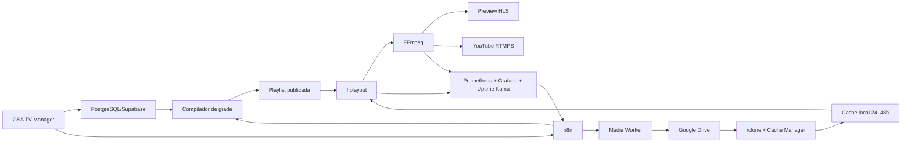

# Plano de implantação técnica — GSA TV

> **DOCUMENTO HIST?RICO / SUPERADO.** A decis?o final substituiu Google Drive/rclone pelo armazenamento definitivo na VPS e consolidou processamento, grade e relay no Control Plane atual. N?o use este documento como runbook nem como evid?ncia de implanta??o. Consulte [docs/arquitetura-atual-gsa-tv.md](../docs/arquitetura-atual-gsa-tv.md) e [infrastructure/gsa-tv/README.md](../infrastructure/gsa-tv/README.md).


**Data:** 17/08/2026  
**Escopo:** instalar, configurar, conectar e homologar toda a infraestrutura técnica da GSA TV até as primeiras transmissões de teste.  
**Fora deste plano:** definição dos nomes dos programas, identidade editorial e grade oficial. Durante a implantação serão utilizadas mídias sintéticas e uma grade técnica provisória.

## Estado da execução em 17/08/2026

- Fase 0 concluída, com restauração real dos bancos e validação dos backups.
- Base isolada da Fase 1 concluída; o saneamento das portas preexistentes depende da migração dos consumidores por IP.
- Núcleo da Fase 2 instalado: ffplayout/FFmpeg ARM64, benchmark 720p30, fallback, healthcheck e backup diário aprovados.
- rclone instalado, ainda sem credenciais ou acesso ao Google Drive.
- Nenhuma chave do YouTube foi cadastrada e nenhuma transmissão externa foi iniciada.

## 1. Resultado esperado

Ao final desta implantação teremos:

- uma pilha GSA TV isolada dentro da VPS Oracle;
- ffplayout controlando a sequência e os horários;
- FFmpeg/FFprobe validando, normalizando e transmitindo;
- Google Drive como biblioteca definitiva;
- cache local preparado para 24–48 horas;
- n8n orquestrando sincronização, publicação, monitoramento e alertas;
- banco de dados registrando mídia, grade, execução e incidentes;
- preview HLS interno protegido;
- GSA TV Manager integrado ao painel administrativo;
- transmissão RTMPS não listada no YouTube;
- fallback e recuperação automática testados;
- homologação contínua de 72 horas concluída.

## 2. Softwares e funções

| Software/componente | Função na GSA TV | Situação inicial |
|---|---|---|
| Oracle Linux 9.8 ARM64 | sistema operacional da VPS | já existente |
| Docker Engine | isolamento dos serviços | já existente |
| Docker Compose | definição e operação da pilha | já existente |
| Nginx | HTTPS, proxy e acesso ao preview | já existente; será ajustado |
| PostgreSQL/Supabase | metadados, grade, direitos e auditoria | já existente; receberá estrutura própria |
| n8n | orquestração, jobs, monitoramento e alertas | já existente |
| FFmpeg | normalização, encode, preview e RTMPS | será instalado em versão fixada |
| FFprobe | inspeção técnica dos arquivos | acompanha o FFmpeg |
| ffplayout | motor de playout e playlist 24/7 | será instalado/compilado para ARM64 |
| rclone | transferência retomável entre Google Drive e cache | será instalado em versão fixada |
| Google Drive API/OAuth | catálogo, autenticação e operações da biblioteca | será configurado na etapa de conexão |
| GSA TV Media Worker | serviço próprio para validação e processamento | será desenvolvido |
| GSA TV Cache Manager | serviço próprio para preparar e limpar o cache | será desenvolvido |
| GSA TV Playout API | controle seguro do ffplayout, sem shell no navegador | será desenvolvido |
| Prometheus | coleta de métricas técnicas | será implantado |
| node_exporter/cAdvisor | métricas da VPS e dos containers | serão implantados |
| Grafana | painéis de CPU, memória, disco, rede e playout | será implantado |
| Uptime Kuma | verificação simples de disponibilidade | será implantado |

Todas as versões serão fixadas. Não serão utilizadas imagens ou dependências flutuantes com a tag `latest` em produção.

## 3. Arquitetura técnica



## 4. Separação das etapas

### Bloco A — implantação técnica desconectada

Instalação e testes locais, sem acesso ao Google Drive e sem chave do YouTube.

### Bloco B — conexão dos componentes

Conexão com banco, GSA Hub, n8n, Google Drive e preview HTTPS.

### Bloco C — transmissão de teste

Conexão com uma live não listada do YouTube, testes progressivos e homologação.

## 5. Fase 0 — inventário, backup e proteção do ambiente

**Duração estimada:** 1–2 dias  
**Alterações de transmissão:** nenhuma

### Execução

1. Inventariar containers, imagens, redes, volumes, serviços e portas.
2. Medir consumo atual de CPU, memória, disco e rede.
3. Exportar workflows e credenciais cifradas do n8n.
4. Fazer backup verificável do banco e dos volumes críticos.
5. Guardar checksums e testar leitura/restauração em ambiente isolado.
6. Mapear credenciais expostas em arquivos e dumps.
7. Preparar plano de rollback de firewall, Nginx e Docker.
8. Registrar a configuração atual antes de qualquer alteração.

### Critério de saída

Backup validado e capacidade de retornar ao estado anterior documentada.

## 6. Fase 1 — segurança e isolamento

**Duração estimada:** 1–3 dias

### Execução

1. Rotacionar credenciais expostas ou reutilizadas.
2. Remover segredos de arquivos versionados.
3. Guardar segredos em diretório protegido/cofre de secrets.
4. Fechar portas públicas desnecessárias de PostgreSQL, Redis, n8n e APIs internas.
5. Manter acesso público somente por HTTPS e administração autorizada.
6. Colocar o n8n atrás do Nginx com HTTPS.
7. Adicionar healthchecks aos serviços atuais.
8. Criar usuário Linux de serviço para a GSA TV.
9. Criar rede Docker exclusiva `gsa-tv-net`.
10. Criar diretórios persistentes sob `/opt/gsa-tv`.
11. Definir cotas, retenção de logs e limites de recursos.

### Testes

- GSA Hub continua acessível;
- n8n e integrações existentes continuam funcionando;
- banco e Redis não respondem diretamente pela internet;
- reinício dos containers preserva dados e configurações.

### Critério de saída

Ambiente seguro, isolado e sem regressão nos serviços existentes.

## 7. Fase 2 — criação da pilha técnica desconectada

**Duração estimada:** 2–4 dias

### Containers/serviços previstos

```text
gsa-tv-ffplayout
gsa-tv-media-worker
gsa-tv-cache-manager
gsa-tv-playout-api
gsa-tv-prometheus
gsa-tv-cadvisor
gsa-tv-grafana
gsa-tv-uptime-kuma
```

O Nginx e o banco existentes serão reutilizados com configuração isolada. Não será criado outro banco público.

### Execução

1. Criar `compose.yml` da GSA TV.
2. Fixar versões e digests das imagens.
3. Criar volumes persistentes.
4. Criar healthchecks e dependências de inicialização.
5. Configurar políticas de reinício.
6. Definir limites de CPU e memória.
7. Impedir acesso dos containers ao Docker socket.
8. Criar endpoints locais de saúde.
9. Criar logs estruturados com rotação.
10. Validar subida, parada e reinício completo da pilha.

### Critério de saída

Toda a pilha sobe e desce de forma controlada, sem Google Drive, YouTube ou dados reais.

## 8. Fase 3 — FFmpeg/FFprobe e padrão técnico

**Duração estimada:** 1–3 dias

### Configuração-base

- saída inicial 1280×720;
- 30 fps progressivo;
- H.264 High, CBR 4 Mbps;
- keyframe a cada 2 segundos;
- AAC estéreo 48 kHz, 128 kbps;
- 16:9;
- áudio normalizado;
- masters técnicos em 1080p.

### Execução

1. Instalar/buildar FFmpeg e FFprobe ARM64 em versão fixada.
2. Confirmar codecs, filtros e protocolos necessários.
3. Criar comando/preset de validação.
4. Criar preset de normalização.
5. Criar preset de thumbnail e preview.
6. Criar preset de HLS interno.
7. Criar preset RTMPS, inicialmente sem chave real.
8. Criar mídia sintética de teste com movimento, voz e barras técnicas.
9. Medir velocidade de processamento e consumo.

### Critério de saída

Arquivos diferentes são convertidos para um padrão único e reproduzidos sem erro ou dessincronização.

## 9. Fase 4 — prova ARM64 do ffplayout

**Duração estimada:** 2–4 dias  
**Gate técnico principal:** sim

### Execução

1. Selecionar versão fixada do ffplayout.
2. Compilar ou empacotar para ARM64, se não houver pacote apropriado.
3. Criar configuração headless.
4. Criar playlist técnica de seis horas.
5. Testar troca de arquivos, logo, texto e filler.
6. Testar arquivo ausente e corrompido.
7. Testar reinício no meio da playlist.
8. Executar 24 horas em loop local.
9. Medir CPU, RAM, I/O e dropped frames.
10. Fazer teste exploratório em 1080p30, sem tornar 1080p requisito do MVP.

### Critérios de aprovação

- 720p30 estável por 24 horas;
- CPU média inferior a 70% e pico desejável abaixo de 85%;
- memória abaixo de 75%;
- nenhuma interrupção perceptível superior a 2 segundos;
- fallback acionado quando necessário;
- retorno automático após reboot.

### Alternativa se não passar

Substituir o ffplayout por um serviço de playout próprio baseado diretamente em FFmpeg e playlists compiladas. Se a VPS também não sustentar esse modo, usar um segundo nó x86 exclusivamente para o playout.

## 10. Fase 5 — banco técnico e APIs internas

**Duração estimada:** 3–5 dias

### Execução

1. Criar migrations das tabelas de canal, mídia, versões, grade, itens, execução, eventos, jobs e incidentes.
2. Criar papéis e políticas de acesso.
3. Criar estados de mídia e grade.
4. Criar API segura para ingestão e consulta.
5. Criar GSA TV Media Worker.
6. Criar GSA TV Cache Manager.
7. Criar GSA TV Playout API.
8. Criar compilador de playlist.
9. Criar publicação atômica e rollback de playlist.
10. Criar trilha de auditoria.
11. Criar testes unitários, de contrato e integração.

### Regra de segurança

O navegador nunca executará shell, FFmpeg, Docker ou comandos do sistema. Toda ação passará por API autenticada, autorizada e auditada.

### Critério de saída

A pilha pode receber uma grade técnica, compilá-la, publicá-la e controlar o playout por APIs internas.

## 11. Fase 6 — monitoramento, alertas e contingência

**Duração estimada:** 2–4 dias

### Execução

1. Configurar Prometheus, node_exporter e cAdvisor.
2. Criar dashboards no Grafana.
3. Configurar Uptime Kuma para endpoints essenciais.
4. Exportar métricas de FFmpeg/ffplayout.
5. Monitorar CPU, RAM, disco, cache, rede, dropped frames e bitrate.
6. Criar heartbeat independente do n8n.
7. Criar watchdog de processo.
8. Criar vídeo e playlist de contingência locais.
9. Configurar reinício e reconexão automáticos.
10. Enviar eventos ao n8n para alertas.

### Alertas mínimos

- processo parado;
- ausência de heartbeat;
- cache incompleto;
- próximo arquivo ausente;
- disco acima de 70%, 80% e 90%;
- CPU ou memória acima do limite;
- dropped frames;
- saída RTMPS desconectada;
- licença bloqueada na grade;
- Drive indisponível durante preparação.

### Critério de saída

Falhas simuladas aparecem no painel, geram alerta e acionam contingência sem interromper o restante da VPS.

## 12. Fase 7 — GSA TV Manager técnico

**Duração estimada:** 5–8 dias

Nesta fase será criada a ferramenta; a programação oficial ainda não será definida.

### Telas técnicas iniciais

1. Central ao vivo.
2. Status dos serviços.
3. Biblioteca técnica.
4. Grade técnica provisória.
5. Publicação e rollback.
6. Cache das próximas 48 horas.
7. Automações e jobs.
8. Incidentes e auditoria.
9. Configurações protegidas.

### Execução

1. Adicionar módulo GSA TV ao painel administrativo.
2. Criar permissões específicas.
3. Integrar APIs internas.
4. Exibir preview HLS protegido.
5. Exibir conteúdo atual e próximo.
6. Criar comandos seguros de próximo item e contingência.
7. Criar editor de grade totalmente configurável.
8. Criar testes responsivos, de acesso e integração.

### Critério de saída

O operador controla todo o ambiente técnico sem acessar terminal, n8n ou arquivos da VPS.

## 13. Fase 8 — conexão com o Google Drive

**Duração estimada:** 2–4 dias

### Execução

1. Criar/confirmar a conta Google definitiva da GSA.
2. Criar a pasta raiz `GSA TV` e sua hierarquia.
3. Criar projeto no Google Cloud.
4. Habilitar Drive API.
5. Configurar OAuth 2.0.
6. Guardar tokens somente no cofre de segredos.
7. Configurar rclone com acesso mínimo necessário.
8. Implementar upload retomável.
9. Implementar monitoramento da pasta `00_INBOX`.
10. Registrar IDs dos arquivos no banco.
11. Implementar checksum Drive → cache.
12. Implementar retry/backoff para 403/429.
13. Testar arquivo grande e retomada após interrupção.
14. Testar Drive indisponível com cache já preparado.

### Regra operacional

Nenhum item será colocado no ar diretamente do Drive. O compilador só publicará a grade depois que todos os arquivos estiverem no cache local e com checksum válido.

### Critério de saída

Um arquivo colocado no Drive é detectado, validado, registrado, normalizado e preparado no cache automaticamente.

## 14. Fase 9 — conexão e workflows do n8n

**Duração estimada:** 3–6 dias

### Workflows técnicos

1. `GSA TV 01 — Media Ingest`.
2. `GSA TV 02 — Schedule Compile`.
3. `GSA TV 03 — Cache Warmup`.
4. `GSA TV 04 — Playout Monitor`.
5. `GSA TV 05 — YouTube Monitor`.
6. `GSA TV 06 — Rights Watch`.
7. `GSA TV 08 — Daily Technical Report`.

O workflow de produção editorial por IA será criado posteriormente, quando a linha editorial estiver definida.

### Execução

1. Criar credenciais isoladas no n8n.
2. Criar workflows idempotentes.
3. Configurar retries, timeout e fila de falhas.
4. Integrar banco, Drive, cache, playout e alertas.
5. Exportar workflows versionados.
6. Testar n8n desligado e reconciliação após retorno.

### Critério de saída

O n8n automatiza a preparação e o monitoramento, mas sua parada não interrompe a grade já publicada.

## 15. Fase 10 — preview interno integrado

**Duração estimada:** 1–2 dias

### Execução

1. Configurar saída HLS interna.
2. Publicar pelo Nginx sob HTTPS.
3. Proteger por autenticação e autorização do GSA Hub.
4. Definir retenção curta dos segmentos.
5. Integrar player à Central ao Vivo.
6. Testar desktop, celular e diferentes conexões.
7. Confirmar sincronismo de áudio e vídeo.

### Critério de saída

Operador autorizado acompanha o sinal interno antes de qualquer conexão com o YouTube.

## 16. Fase 11 — conexão com o YouTube não listado

**Duração estimada:** 1–2 dias

### Pré-requisitos

- canal GSA TV criado e verificado;
- transmissão ao vivo habilitada;
- autenticação multifator na conta;
- chave persistente exclusiva de homologação.

### Execução

1. Criar live não listada.
2. Guardar a chave somente no secret store da VPS.
3. Configurar RTMPS.
4. Transmitir barras técnicas e vídeo sintético.
5. Conferir resolução, bitrate, keyframe e saúde do encoder.
6. Conferir áudio e vídeo em dispositivos diferentes.
7. Simular queda da conexão.
8. Confirmar reconexão automática.
9. Confirmar que a chave não aparece em logs, painel ou banco.

### Critério de saída

Live não listada recebida pelo YouTube com saúde estável e reconexão comprovada.

## 17. Fase 12 — sequência dos primeiros testes ao vivo

Cada etapa só começa após aprovação da anterior.

### Teste 1 — 30 minutos

- barras, relógio, voz, música autorizada e troca de arquivos;
- verificação de áudio, vídeo e keyframes.

### Teste 2 — 2 horas

- grade técnica com vinheta, conteúdo, comercial e filler;
- uma falha de arquivo simulada.

### Teste 3 — 6 horas

- sincronização de cache;
- atualização da próxima playlist;
- queda controlada do n8n.

### Teste 4 — 12 horas

- reinício do ffplayout/FFmpeg;
- reconexão ao YouTube;
- verificação de drift e memória.

### Teste 5 — 24 horas

- reboot controlado da VPS;
- retomada automática;
- Drive temporariamente indisponível com cache completo.

### Teste 6 — homologação de 72 horas

- operação contínua;
- grade técnica completa;
- monitoramento e relatórios;
- nenhum ajuste durante a janela, salvo correção de falha crítica.

## 18. Fase 13 — testes de falha obrigatórios

- arquivo ausente;
- arquivo corrompido;
- codec não aceito;
- duração divergente;
- cache incompleto;
- Google Drive indisponível;
- cota/erro 403 ou 429 do Drive;
- n8n parado;
- banco indisponível;
- ffplayout encerrado;
- FFmpeg encerrado;
- Nginx reiniciado;
- queda de internet;
- chave RTMPS inválida no ambiente de teste;
- disco em alerta;
- grade alterada durante a exibição;
- comando por usuário não autorizado;
- reboot completo da VPS.

Uma falha crítica durante a homologação reinicia a contagem das 72 horas após a correção.

## 19. Critérios finais de homologação

- 72 horas contínuas sem interrupção crítica;
- ausência de tela preta ou silêncio prolongado;
- zero conteúdo não aprovado exibido;
- fallback automático funcional;
- retorno após reboot dentro do limite aprovado;
- YouTube informando conexão saudável;
- CPU, memória, disco e rede com margem;
- cache cobrindo no mínimo as próximas 24 horas;
- nenhum segredo no frontend ou nos logs;
- relatório real do que foi ao ar;
- alertas recebidos e incidentes auditáveis;
- backup e rollback testados;
- runbook operacional entregue.

## 20. Cronograma técnico indicativo

| Semana | Implantação |
|---|---|
| 1 | inventário, backup, segurança e isolamento |
| 2 | Compose, FFmpeg, ffplayout e prova ARM64 |
| 3 | banco, APIs internas, monitoramento e contingência |
| 4 | GSA TV Manager técnico e preview HLS |
| 5 | Google Drive, rclone, cache e workflows n8n |
| 6 | conexão com YouTube e testes de 30 min a 12 h |
| 7 | teste de 24 h, correções e homologação de 72 h |
| 8 | reserva para repetição da homologação e documentação final |

**Prazo técnico previsto:** 6 a 8 semanas. A criação da programação oficial poderá começar em paralelo depois que a Central ao Vivo, a biblioteca e a grade configurável estiverem funcionais.

## 21. Ordem para iniciar a execução

1. Aprovar este plano técnico.
2. Executar Fase 0: inventário e backup.
3. Apresentar o relatório da linha de base.
4. Executar Fase 1: segurança e isolamento.
5. Validar que o GSA Hub atual continua funcionando.
6. Montar a pilha técnica desconectada.
7. Realizar o gate ARM64 de ffplayout/FFmpeg.
8. Somente depois desenvolver as conexões e iniciar as transmissões de teste.

Nenhuma transmissão pública faz parte desta implantação inicial. A abertura pública será um projeto posterior, depois da homologação técnica e da criação da programação oficial.
