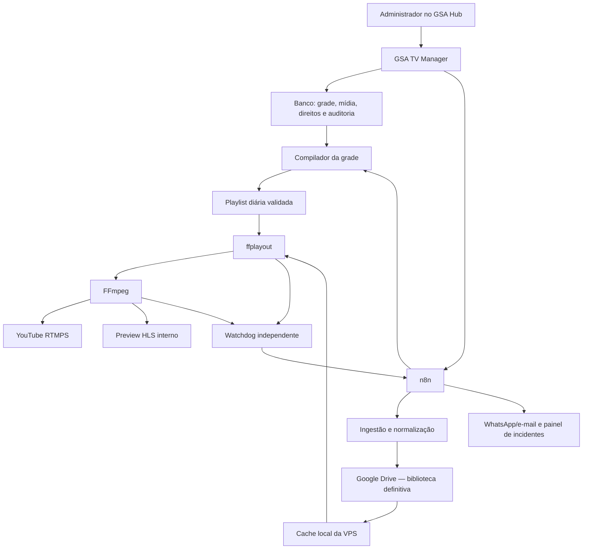

# Plano de implementação — GSA TV 24/7

> **DOCUMENTO HIST?RICO / SUPERADO.** A decis?o final substituiu Google Drive/rclone pelo armazenamento definitivo na VPS e consolidou processamento, grade e relay no Control Plane atual. N?o use este documento como runbook nem como evid?ncia de implanta??o. Consulte [docs/arquitetura-atual-gsa-tv.md](../docs/arquitetura-atual-gsa-tv.md) e [infrastructure/gsa-tv/README.md](../infrastructure/gsa-tv/README.md).


**Status:** arquitetura aprovada para implantação  
**Data:** 17/08/2026  
**Arquitetura:** GSA TV Manager + Supabase/PostgreSQL + n8n + Google Drive + cache local + ffplayout + FFmpeg + YouTube RTMPS

> O roteiro específico de instalação dos softwares, conexão dos componentes e primeiras transmissões de teste está em [Plano de implantação técnica — GSA TV](./plano-implantacao-tecnica-gsa-tv.md).

## 1. Objetivo da implementação

Implantar uma emissora digital da GSA com:

- transmissão contínua no YouTube;
- grade semanal administrada dentro do GSA Hub;
- biblioteca de vídeos e peças comerciais;
- automações pelo n8n;
- controle de direitos autorais e aprovações;
- monitoramento, contingência e histórico do que foi ao ar;
- possibilidade futura de produção de notícias, programas e quadros com IA, voz sintética e templates próprios.

## 2. Decisões já aprovadas

- O motor de playout será **ffplayout + FFmpeg**.
- O n8n será o orquestrador, mas não será responsável por reproduzir vídeo em tempo real.
- O painel operacional será criado como um novo módulo administrativo do GSA Hub.
- O **Google Drive será o armazenamento definitivo** de vídeos, masters, versões de transmissão, vinhetas, peças comerciais, previews, miniaturas e documentos da GSA TV.
- A VPS manterá somente cache operacional de 24–48 horas, contingência, playlists e gravações temporárias.
- O ffplayout nunca reproduzirá arquivos diretamente do Google Drive: todo item da grade deverá estar validado e presente no cache local antes de ir ao ar.
- A programação, os nomes dos programas e a grade editorial ainda serão criados; qualquer nome citado nos documentos é apenas exemplo provisório.
- Programas, quadros, faixas e horários serão cadastros configuráveis, sem nomes ou horários fixados no código.
- A transmissão inicial será em 720p30 para homologação e estabilidade.
- Os masters, vinhetas e artes serão produzidos em 1080p.
- A primeira transmissão será privada ou não listada.
- A transmissão pública só será liberada depois de um teste contínuo de 72 horas.
- O CasparCG ficará fora do MVP e poderá ser reavaliado no futuro para produção ao vivo com GPU.

## 3. Escopo do MVP

### Incluído

- canal único GSA TV;
- grade de domingo a domingo;
- programas, quadros, comerciais, vinhetas e fillers;
- upload e biblioteca de mídia;
- normalização automática de áudio e vídeo;
- armazenamento definitivo no Google Drive;
- cache local de 24–48 horas;
- publicação de grade;
- transmissão RTMPS para o YouTube;
- preview interno;
- fallback automático;
- monitoramento e alertas;
- auditoria e relatório de exibição;
- automações essenciais do n8n;
- controle documental de direitos autorais.

### Fora do MVP

- estúdio multicâmera ao vivo;
- chroma key e cenário virtual em tempo real;
- aplicativo para Smart TV;
- múltiplos canais simultâneos;
- distribuição para outras plataformas além do YouTube;
- produção totalmente autônoma de jornalismo sem aprovação humana;
- monetização ou venda automatizada de publicidade externa.

## 4. Arquitetura operacional



## 5. Estrutura prevista na VPS

Criar uma implantação isolada dos serviços atuais:

```text
/opt/gsa-tv/
├── compose/
├── config/
├── secrets/
├── playlists/
│   ├── published/
│   └── previous/
├── cache/
│   ├── media/
│   ├── incoming/
│   └── quarantine/
├── fallback/
├── preview/
├── recordings/
├── logs/
└── backups/
```

Princípios:

- usuário de serviço próprio, sem login interativo;
- rede Docker dedicada;
- nenhum acesso direto ao banco ou ao Docker socket;
- segredos fora do repositório e com permissão restrita;
- volumes persistentes com limites de retenção;
- healthchecks e política de reinício;
- limites de CPU e memória para não prejudicar o GSA Hub.

### Estrutura definitiva no Google Drive

```text
GSA TV/
├── 00_INBOX/
├── 01_MASTERS/
├── 02_TRANSMISSAO/
│   ├── PROGRAMAS/
│   ├── COMERCIAIS/
│   ├── VINHETAS/
│   ├── FILLERS/
│   └── CONTINGENCIA/
├── 03_PREVIEWS/
├── 04_MINIATURAS/
├── 05_IDENTIDADE/
├── 06_DIREITOS_E_LICENCAS/
├── 07_GRAVACOES/
├── 08_RELATORIOS/
└── 99_ARQUIVO/
```

Regras:

- a pasta raiz será acessada por OAuth 2.0 de uma conta controlada pela GSA;
- o token de atualização ficará somente no cofre de segredos da VPS/n8n;
- o banco armazenará IDs do Drive e metadados, nunca links públicos permanentes;
- uploads e downloads grandes usarão transferência retomável;
- erros 403/429 terão retry com espera progressiva e limite;
- arquivos aprovados terão checksum conferido no Drive e novamente no cache;
- mover ou renomear arquivos será feito pelo painel/automação para não quebrar referências;
- o Google Drive será a origem definitiva, mas a continuidade da transmissão dependerá apenas do cache já preparado.

## 6. Padrão técnico da emissora

### Saída inicial

- 1280×720, 30 fps, progressivo;
- H.264, perfil High;
- CBR 4 Mbps;
- GOP/keyframe de 2 segundos;
- AAC estéreo, 48 kHz, 128 kbps;
- 16:9, pixels quadrados;
- áudio normalizado para padrão único da GSA TV;
- RTMPS como protocolo de entrega.

### Regras para arquivos de entrada

- aceitar MP4, MOV e formatos que o FFmpeg consiga validar;
- recusar arquivo corrompido, sem duração ou sem trilha de áudio esperada;
- gerar uma versão normalizada para exibição;
- preservar o master original no Google Drive;
- gerar checksum, miniatura e preview;
- manter duração real calculada por FFprobe;
- nunca colocar o upload original diretamente no ar sem validação.

## 7. Fases de implementação

## Fase 0 — preparação, backup e linha de base

**Duração estimada:** 1–2 dias  
**Risco:** baixo, predominantemente leitura e backup

### Tarefas

1. Registrar inventário da VPS, containers, volumes, redes e consumo atual.
2. Exportar configurações e workflows do n8n.
3. Criar backup verificável dos bancos e volumes envolvidos.
4. Testar pelo menos a leitura e integridade dos backups.
5. Registrar uso médio de CPU, RAM, disco e rede por 24 horas.
6. Identificar todas as portas e serviços publicados.
7. Criar documento de rollback para cada alteração da fase seguinte.

### Entregáveis

- inventário técnico;
- backup com checksum;
- linha de base de recursos;
- mapa de portas e redes;
- procedimento de restauração.

### Gate de aprovação

Não iniciar alterações de segurança ou novos containers sem backup confirmado.

## Fase 1 — segurança e isolamento

**Duração estimada:** 1–3 dias  
**Risco:** médio; pode afetar integrações se executado sem mapeamento

### Tarefas

1. Inventariar credenciais atualmente gravadas em arquivos e dumps.
2. Rotacionar credenciais expostas ou compartilhadas.
3. Retirar segredos do código e de arquivos versionados.
4. Fechar no firewall o acesso público direto a banco, Redis, n8n e APIs internas.
5. Manter publicamente apenas HTTPS e o acesso administrativo estritamente necessário.
6. Colocar o n8n atrás de proxy HTTPS.
7. Proteger webhooks com assinatura/token, rate limit e validação de origem.
8. Adicionar healthcheck aos serviços críticos que ainda não possuem.
9. Criar a rede Docker isolada `gsa-tv`.
10. Definir uma conta de serviço e diretórios protegidos.

### Entregáveis

- firewall revisado;
- credenciais rotacionadas;
- serviços internos sem exposição direta;
- rede e usuário de serviço da GSA TV;
- relatório de validação das integrações existentes.

### Gate de aprovação

GSA Hub, n8n, WhatsApp e demais integrações existentes continuam funcionando após o endurecimento.

## Fase 2 — prova de conceito ARM64

**Duração estimada:** 2–4 dias  
**Risco:** técnico alto; é o principal gate da arquitetura

### Tarefas

1. Selecionar e fixar uma versão do FFmpeg compatível com ARM64.
2. Selecionar uma versão estável/fixada do ffplayout e construir uma imagem reproduzível ARM64, se necessário.
3. Subir os componentes em ambiente isolado, sem conexão com a chave pública do YouTube.
4. Criar mídia sintética de teste com movimento, voz, música autorizada e silêncio controlado.
5. Executar playlist de seis horas em loop.
6. Testar logo, texto, troca de arquivos e vídeo de contingência.
7. Gerar saída local e preview HLS.
8. Medir CPU, RAM, I/O, dropped frames e estabilidade.
9. Repetir em 720p30 e realizar benchmark exploratório em 1080p30.
10. Documentar a configuração aprovada.

### Critérios de sucesso

- 720p30 estável;
- CPU média desejável abaixo de 70% e picos abaixo de 85%;
- memória abaixo de 75%;
- sem interrupção perceptível superior a 2 segundos;
- sem crescimento contínuo de memória;
- fallback reproduzido quando um arquivo fica indisponível;
- serviço retorna automaticamente após reinício.

### Plano alternativo do gate

Se o ffplayout não passar no ARM64, implementar um serviço de playout controlado baseado diretamente em FFmpeg e playlists compiladas. Se o FFmpeg também não sustentar 720p30 com margem, provisionar um segundo nó x86_64 apenas para playout.

## Fase 3 — banco de dados e regras de negócio

**Duração estimada:** 3–5 dias

### Tarefas

1. Criar migrations para:
   - `tv_channels`;
   - `tv_programs`;
   - `tv_assets`;
   - `tv_asset_renditions`;
   - `tv_rights`;
   - `tv_schedule_days`;
   - `tv_schedule_items`;
   - `tv_commercial_campaigns`;
   - `tv_playout_runs`;
   - `tv_playout_events`;
   - `tv_automation_jobs`;
   - `tv_incidents`.
2. Criar políticas de acesso por função.
3. Criar estados de aprovação e transições válidas.
4. Bloquear publicação sem mídia aprovada, direitos válidos ou duração conhecida.
5. Criar versionamento da grade.
6. Criar trilha de auditoria.
7. Criar funções/RPCs seguras para publicação e rollback da grade.
8. Criar testes de contrato e migrations.

### Estados essenciais

```text
Mídia: recebido → validando → revisão → aprovado → disponível
                              ↘ bloqueado

Grade: rascunho → validação → aprovação → publicada → encerrada
                                      ↘ rejeitada
```

### Gate de aprovação

Nenhuma mídia bloqueada ou sem licença consegue entrar em uma grade publicada.

## Fase 4 — GSA TV Manager no painel administrativo

**Duração estimada:** 5–8 dias

### Tarefas

1. Adicionar o módulo principal **GSA TV** no painel administrativo.
2. Implementar rotas e permissões.
3. Criar Central ao Vivo.
4. Criar Grade Semanal.
5. Criar Programas e Quadros.
6. Criar Biblioteca de Mídia.
7. Criar Direitos e Conformidade.
8. Criar Comerciais.
9. Criar Automações.
10. Criar Incidentes e Auditoria.
11. Implementar validações visuais e mensagens claras.
12. Implementar responsividade e acessibilidade.
13. Criar testes unitários e de integração do módulo.

### Gate de aprovação

Um administrador consegue cadastrar programa, enviar mídia, aprovar direitos, montar 24 horas de grade e publicar uma versão sem acessar diretamente a VPS ou o n8n.

## Fase 5 — Google Drive, ingestão e cache

**Duração estimada:** 4–7 dias

### Tarefas

1. Criar a pasta raiz `GSA TV` e sua estrutura definitiva no Google Drive.
2. Criar projeto Google Cloud, habilitar a Drive API e configurar OAuth 2.0 para a conta da GSA.
3. Armazenar client ID, segredo e refresh token exclusivamente no cofre de segredos.
4. Registrar no sistema o ID imutável de cada pasta e arquivo, sem depender do nome do caminho.
5. Implementar entrada por upload do painel e por monitoramento da pasta `00_INBOX`.
6. Implementar transferência retomável para arquivos grandes.
7. Implementar validação por FFprobe.
8. Implementar normalização por FFmpeg.
9. Enviar master, versão de transmissão, miniatura, preview e documentos para as pastas corretas do Drive.
10. Gerar e conferir checksum antes e depois do envio.
11. Implementar quarentena lógica para mídia inválida ou sem aprovação.
12. Implementar sincronização antecipada das próximas 24–48 horas para o cache local.
13. Implementar retry com backoff e fila de reprocessamento para cotas ou indisponibilidade da Drive API.
14. Implementar limpeza LRU sem remover mídia em uso.
15. Definir limites de disco e alertas em 70%, 80% e 90%.
16. Garantir que a perda do Google Drive durante a exibição não interrompa a grade já cacheada.

### Gate de aprovação

Um arquivo enviado pelo painel ou colocado na pasta `00_INBOX` recebe versão normalizada, é organizado no Google Drive e fica disponível no cache sem intervenção manual.

## Fase 6 — compilador de grade e playout

**Duração estimada:** 4–7 dias

### Tarefas

1. Implementar compilador de grade diária.
2. Resolver recorrências, reprises, comerciais e fillers.
3. Validar cobertura exata de 24 horas.
4. Validar disponibilidade e checksum dos arquivos.
5. Gerar playlist em formato aceito pelo ffplayout.
6. Publicar playlist de modo atômico.
7. Preservar a versão anterior para rollback.
8. Integrar ffplayout e FFmpeg.
9. Gerar preview HLS interno protegido.
10. Configurar saída RTMPS sem expor a chave.
11. Registrar conteúdo atual, próximo, horário real e resultado.
12. Implementar comandos seguros de próximo item, contingência e retomada.
13. Impedir que um comando do painel derrube o processo sem confirmação e autorização.

### Gate de aprovação

Uma grade publicada inicia no horário correto, executa todos os itens, registra o que foi ao ar e usa fallback em caso de falha.

## Fase 7 — workflows do n8n

**Duração estimada:** 4–7 dias

Criar e versionar os seguintes workflows:

1. **GSA TV 01 — Media Ingest**
   - recebe evento de upload;
   - valida, normaliza, gera preview e atualiza status.

2. **GSA TV 02 — Schedule Compile**
   - compila e publica grade aprovada;
   - preserva a grade anterior em caso de erro.

3. **GSA TV 03 — Cache Warmup**
   - baixa e verifica a mídia das próximas 24–48 horas.

4. **GSA TV 04 — Playout Monitor**
   - acompanha heartbeat, conteúdo atual, atraso, CPU, memória e disco.

5. **GSA TV 05 — YouTube Monitor**
   - acompanha a saída RTMPS e a saúde da transmissão.

6. **GSA TV 06 — Rights Watch**
   - bloqueia licença expirada e avisa antecipadamente.

7. **GSA TV 07 — Content Production**
   - pauta, roteiro, voz, renderização e aprovação humana.
   - somente entra após a base de transmissão estar homologada.

8. **GSA TV 08 — Daily Report**
   - resume exibições, falhas, comerciais, disponibilidade e uso de APIs.

### Regras dos workflows

- idempotência para evitar duplicações;
- retry com limite e espera progressiva;
- fila de falhas para reprocessamento;
- nenhum segredo em logs;
- correlation ID por execução;
- timeout explícito para APIs externas;
- alerta somente quando houver ação necessária;
- exportação versionada dos workflows.

### Gate de aprovação

Desativar o n8n não pode interromper a playlist já publicada. Ao retornar, ele reconcilia o estado sem duplicar tarefas.

## Fase 8 — identidade e conteúdo inicial

**Duração estimada:** paralela, 5–15 dias

### Pacote mínimo de identidade

- logo GSA TV para tela;
- bug/marca d'água;
- vinheta de abertura e encerramento;
- bumper “Você está assistindo à GSA TV”;
- transições;
- GC/manchetes;
- tela “A seguir”;
- tela de contingência;
- relógio/faixa informativa, se aprovada;
- padrão de créditos e fontes;
- identidade sonora licenciada.

### Conteúdo mínimo para o piloto

- seis horas de conteúdo aprovado;
- três programas próprios;
- duas vinhetas;
- peças institucionais do GSA Hub;
- dois blocos comerciais;
- fillers de durações variadas;
- pelo menos duas horas de contingência.

### Gate de aprovação

Todo conteúdo possui responsável, origem, prova de uso, classificação e aprovação editorial.

## Fase 9 — integração com o YouTube

**Duração estimada:** 1–2 dias

### Dependências

- canal GSA TV criado e verificado;
- transmissão ao vivo habilitada;
- chave persistente de teste;
- título, descrição, miniatura e política de chat definidos;
- decisão sobre conteúdo infantil e classificação;
- conta administrativa com autenticação multifator.

### Tarefas

1. Criar uma live não listada de homologação.
2. Armazenar a chave somente no secret store da VPS.
3. Configurar RTMPS.
4. Validar resolução, bitrate, keyframes, áudio e saúde do encoder.
5. Confirmar reconexão após queda simulada.
6. Definir política de gravação local, pois uma live contínua acima de 12 horas não deve depender do arquivo automático do YouTube.

### Gate de aprovação

YouTube informa conexão saudável e o operador consegue confirmar áudio, vídeo e sincronismo em dispositivos diferentes.

## Fase 10 — testes de falha e homologação de 72 horas

**Duração estimada:** 4–6 dias

### Cenários obrigatórios

- mídia ausente;
- arquivo corrompido;
- duração divergente;
- Google Drive ou Drive API temporariamente indisponível;
- n8n parado;
- banco temporariamente indisponível;
- FFmpeg encerrado;
- ffplayout encerrado;
- queda e retorno da internet;
- reboot completo da VPS;
- disco em alerta;
- grade alterada durante transmissão;
- licença vencida;
- chave do YouTube inválida no ambiente de teste;
- falha na API de IA/TTS;
- tentativa de comando por usuário sem permissão.

### Critérios de homologação

- 72 horas sem interrupção crítica;
- ausência de tela preta ou silêncio prolongado;
- fallback automático;
- retorno após reboot em até 60 segundos, ou limite validado pelo teste;
- nenhum segredo presente em frontend ou logs;
- zero item não aprovado exibido;
- logs e relatórios conciliados com a grade;
- alertas entregues;
- CPU, memória, disco e rede com margem operacional.

Se ocorrer falha crítica, corrigir a causa e reiniciar a contagem de 72 horas.

## Fase 11 — lançamento público controlado

**Duração estimada:** 2–3 dias

### Tarefas

1. Congelar a grade das primeiras 24 horas.
2. Confirmar cache completo e checksums.
3. Confirmar fallback e playlist anterior.
4. Fazer backup das configurações homologadas.
5. Trocar para a chave/live pública.
6. Manter operador acompanhando as primeiras 24 horas.
7. Evitar atualizações não essenciais durante a janela de lançamento.
8. Emitir relatório após 2, 6, 12 e 24 horas.
9. Fazer retrospectiva técnica após sete dias.

### Critério de conclusão

Sete dias de operação pública com disponibilidade, incidentes e correções documentados.

## Fase 12 — operação contínua e evolução

### Rotina diária

- verificar saúde da transmissão;
- conferir cobertura das próximas 48 horas;
- revisar falhas e conteúdo pendente;
- conferir espaço em disco e cache;
- validar licenças próximas do vencimento.

### Rotina semanal

- publicar a grade seguinte;
- testar restauração de amostra;
- revisar alertas e dropped frames;
- revisar audiência e desempenho dos programas;
- atualizar fillers e contingência.

### Rotina mensal

- atualizar dependências primeiro em homologação;
- testar credenciais e acessos;
- revisar cotas da Drive API, custos de IA e tráfego;
- testar restauração completa;
- revisar direitos autorais e documentos;
- planejar evolução para 1080p30.

## 8. Cronograma indicativo

| Semana | Entrega principal |
|---|---|
| 1 | backup, segurança, isolamento e prova ARM64 |
| 2 | banco de dados e base do GSA TV Manager |
| 3 | Google Drive, ingestão, normalização e cache |
| 4 | grade, ffplayout, FFmpeg e preview |
| 5 | workflows n8n, identidade e conteúdo piloto |
| 6 | YouTube, testes de falha e homologação de 72 horas |
| 7 | reserva para correções e lançamento público |

O MVP pode ficar pronto em aproximadamente **5 a 7 semanas**, considerando desenvolvimento, criação do conteúdo mínimo e repetição de testes quando necessário.

## 9. Dependências que serão solicitadas ao responsável pela GSA

Não são necessárias todas no primeiro dia, mas precisam estar disponíveis antes das respectivas fases:

- acesso administrativo ao canal GSA TV no YouTube;
- conta Google definitiva da GSA que será proprietária da pasta `GSA TV`;
- autorização OAuth para a integração com a Drive API;
- canal com live habilitada;
- domínio ou subdomínio desejado, por exemplo `tv.gsa...`;
- logotipo e manual de identidade existente;
- definição do responsável editorial;
- definição do responsável por aprovar direitos/licenças;
- telefone/e-mail que receberá alertas;
- conteúdo inicial e provas de autorização;
- decisão final de título, descrição, slogan e política de chat;
- aprovação dos fornecedores de IA, voz ou notícias que tiverem custo.

## 10. Riscos e respostas

| Risco | Resposta planejada |
|---|---|
| ffplayout não sustentar ARM64 | gate técnico; fallback para serviço FFmpeg ou segundo nó x86 |
| CPU alta sem GPU | começar em 720p30, normalizar previamente e limitar filtros ao vivo |
| disco insuficiente | Google Drive como biblioteca e cache de 24–48 horas com limpeza controlada |
| cota ou indisponibilidade do Drive | cache antecipado, retry com backoff e alerta antes de faltar conteúdo |
| arquivo movido manualmente no Drive | referências pelo ID do arquivo e reconciliação periódica |
| queda do n8n | playout independente com playlist já publicada |
| mídia ausente | cache antecipado, checksum e filler automático |
| conteúdo sem autorização | cadastro obrigatório de direitos e bloqueio na publicação |
| queda do YouTube/rede | reconexão automática, alerta e gravação local segmentada |
| segredo vazado | rotação, secret store e ausência de segredos em frontend/logs |
| atualização quebrar produção | versões fixadas, homologação e rollback para imagem anterior |
| IA produzir informação errada | revisão humana obrigatória antes de disponibilizar conteúdo |

## 11. Ordem exata para começar

### Primeiro ciclo de trabalho

1. Fazer inventário e backup.
2. Validar restauração e rollback.
3. Corrigir exposição de portas e credenciais.
4. Criar diretórios, usuário e rede isolada da GSA TV.
5. Montar a imagem ARM64 de FFmpeg/ffplayout.
6. Executar benchmark local em 720p30.
7. Gerar preview HLS sem transmitir ao YouTube.
8. Simular falha e fallback.
9. Apresentar relatório do gate técnico.
10. Somente após aprovação, iniciar banco e GSA TV Manager.

### Primeira demonstração esperada

Ao final do primeiro ciclo deverá existir, ainda sem público:

- uma playlist de teste;
- ffplayout e FFmpeg rodando isolados;
- preview interno;
- logo da GSA TV sobre o vídeo de teste;
- troca automática para contingência;
- métricas reais de CPU, RAM e estabilidade;
- decisão confirmada sobre a capacidade da VPS.

## 12. Definição final de pronto

A implantação estará concluída quando:

- o GSA TV Manager estiver disponível no painel administrativo;
- a grade de sete dias puder ser montada, validada, aprovada e publicada;
- os vídeos forem validados, normalizados, armazenados e cacheados automaticamente;
- o ffplayout e o FFmpeg funcionarem 24/7 e retornarem após reboot;
- a live pública estiver saudável;
- a contingência estiver comprovada;
- o n8n monitorar e automatizar sem ser ponto único de falha;
- direitos, aprovações e exibições estiverem auditáveis;
- backups, alertas e runbooks estiverem entregues;
- a homologação de 72 horas e os sete primeiros dias públicos estiverem aprovados.
